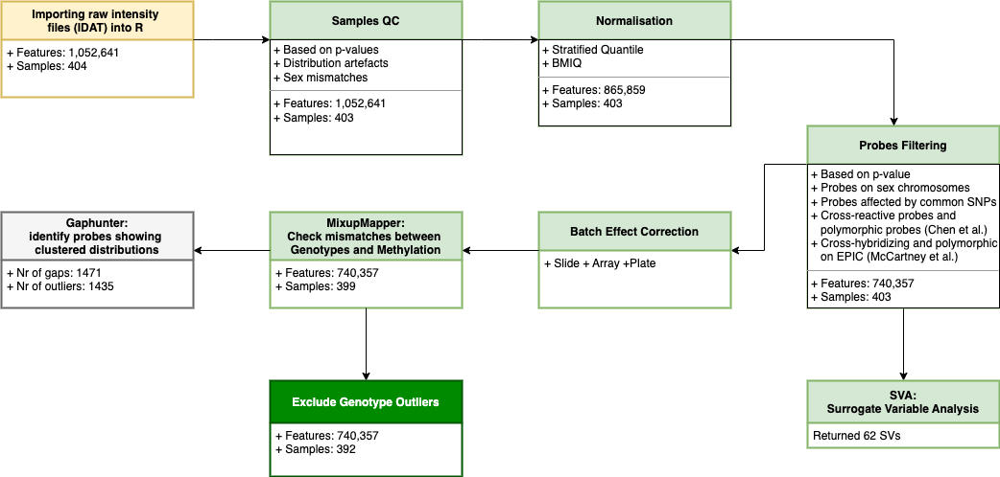

```{r, include=FALSE}
options(digits = 4, width = 100, stringsAsFactors = T)
knitr::opts_chunk$set(echo = TRUE,
                      tidy.opts = list(width.cutoff = 100),
                      tidy=TRUE,
                      fig.pos = "H",
                      dpi = 600,
                      warning = FALSE, 
                      message = FALSE, 
                      cache = TRUE, 
                      cache.lazy = FALSE)

# define DT as the standard printing method for data.frame
library(knitr)
library(DT)
knit_print.data.frame <- function(x, ...) {
  knit_print(DT::datatable(x,
                           filter="top",
                           rownames = FALSE,
                           extensions = "FixedColumns",
                           options = list(
                             scrollX = TRUE,
                             pageLength = 5
                             
                           )), ...)
}

registerS3method("knit_print", "data.frame", knit_print.data.frame)

# load packages
library(data.table)
library(dplyr)
library(ggplot2)
library(corrplot)
library(factoextra)
library(viridis)
library(janitor)
library(GenomicFeatures)
```

```{r plot-param, include = F, eval = T}
cbPalette <- c("grey", "#0072B2")
standard_textsize <- 12
standard_dpi_fig  <- 600
standard_width_mm_single <- 90
standard_width_mm_double <- 180
standard_height_mm <- 100
```

# Introduction
***
```{r, include = F, eval = T}
# source("~/bio/code/mpip/dex-stim-human-array/code/methylation/02_dma/01_dmp/funcitons.R")
source("~/bio/code/mpip/dex-stim-human-array/code/integrative/util.R")
```

The available multiomics data for the currect project:

    - Methylation
    - Gene-expression
    - Genotype
    - Bio layer, or phenotype here

For each omic layer, there is different number of observation. The first four section provides an overview and basic statistics for each layer. The last section represent some additional analysis which includes data from different omic layers.

# Phenotype
***
```{r, include = F, eval = T}
pheno.full.fn <- paste0("~/bio/code/mpip/dex-stim-human-array/data/pheno/pheno_full_for_kimono.csv") 
pheno.full    <- read.csv2(pheno.full.fn) %>% setDT()
```

```{r, include = F, eval = T}
id.names <- c("Sample_ID", "DNA_ID", "RNA_ID", "DNAm_ID", "Pat_ID")
covar.names <- c("Dex", "Sex", "Status", "Age", "BMI_D1", "SNP_Chip", "Batch")
```

### ID names
  + __Sample_ID__: an alphanumeric patient identifier (__289__ is a total number, __197__ is used for analysis)
  + __Pat_ID__: a numeric patient identifier
  + __DNA_ID__: a genotype sample identifier
  + __RNA_ID__: a gene-expression sample identifier
  + __DNAm_ID__: a methylation sample identifier
  
### Available Covariates
  + __Dex__: a dexamethasone treatment group (__1__ is Dex, __0__ is Baseline)
  + __Sex__: a sex group (__1__ is Male, __2__ is Female)
    * 131 (66.5%) Male out of 197
    * 66 (33.5%) Female out of 197
  + __Status__: a MDD status group (__1__ is Case, __0__ is Control)
    * 112 (56.9%) Controls out of 197
    * 85 (43.1%) Cases out of 197
  + __Age__
  + __BMI__ 
  + __BCC__: Cort_D1, ACTH_D1, Leukos_D1, Gran_D1, Mono_D1, Lymph_D1, hamd_D1 - cellular proportion
  + __Batch__: four bacthes (1, 2, 3, Mars) 
  + __SNP_Chip__: a genotype chip (610K and OmniExpress)

### Derived Covariates
  + __DNAm BCC__: CD8T, CD4T, NK, Bcell, Mono, Gran - cellular proportion estimates from Houseman algorithm
  + __CellCODE BCC__: Cort_D1, ACTH_D1, Leukos_D1, Gran_D1, Mono_D1, Lymph_D1, hamd_D1 - cellular proportion estimates from CellCODE
  + __Salas BCC__: cellular proportion estimates using _EpiDISH_ R-package and the reference dataset of 12 cell types (neutrophils, eosinophils, basophils, monocytes, naïve and memory B cells, naïve and memory CD4T and CD8T cells, natural killer, and T regulatory cells) from _Salas et. al 2022_ publication
  + __DNAm SV__: 62 significant Surrogate Variables (SV)
  + __GEX SV__: 43 significant Surrogate Variables (SV)
  + __SNP PC__: 10 signififcant PCs computed using PLINK MDS method (4.26% of total variants)
  + __DNAm Age__: an age estimated from DNAm data using Horvath algorithm
  + __Smoking Score__: smoking score estimated from DNAm data using Elliot's CpGs
  + __PRS__: Polygenic Risk Score, calculated using PRS-CS software and GWASes from UKBiobank and PGC (the PRSs are stored in separatd file for each GWAS)
  + __Include__: a field indicated if the sample is included in the current analysis (__1__ is included, __0__ isn't included)

### Data File
  
```{r, include = T, eval = T}
id.names <- c("Sample_ID", "DNA_ID", "RNA_ID", "DNAm_ID", "Pat_ID")
covar.names <- c("Dex", "Sex", "Status", "Age", "BMI_D1", "SNP_Chip", "Batch")
pheno.full %>% dplyr::select(id.names, covar.names)
```

### Some Analyses {.tabset .tabset-fade .tabset-pills}

```{r, include = F, eval = T}
id.names <- c("DNA_ID", "RNA_ID")
covar.names <- c("Dex", "Sex", "Status", "Age", "BMI_D1", "SNP_Chip", "Batch")
summary(pheno.full %>% dplyr::select(id.names, covar.names))
```

```{r, include = F, eval = T}
plt.df <- pheno.full %>% dplyr::select(id.names, covar.names)

plt.df$Status  <- as.factor(plt.df$Status)
plt.df$Sex     <- as.factor(plt.df$Sex)

levels(plt.df$Sex) <- c("Male", "Female")
levels(plt.df$Status) <- c("Control", "MDD")
```

#### Age 

```{r out.width = "95%", include = T, eval = T}
ggplot(plt.df, aes(x = Age, fill = Status)) + 
  geom_density(alpha = 0.2, aes(color = Status)) +
  theme(legend.position = c(.9,.9), 
        legend.title = element_blank(),
        panel.grid.major = element_blank(),
        panel.background = element_blank(),
        plot.title = element_text(size = 8),
        axis.title = element_text(size = 8)) +
  labs(title = "Density plot of Chronological Age split by MDD status", x = "Chronological Age", y = "") +
  facet_wrap(~ Sex, ncol = 2)
```

#### BMI

```{r out.width = "95%", include = T, eval = T}
ggplot(plt.df, aes(x = BMI_D1, fill = Status)) + 
  geom_density(alpha = 0.2, aes(color = Status)) +
  theme(legend.position = c(.9,.9), 
        legend.title = element_blank(),
        panel.grid.major = element_blank(),
        panel.background = element_blank(),
        plot.title = element_text(size = 8),
        axis.title = element_text(size = 8)) +
  labs(title = "Density plot of BMI split by MDD status", x = "BMI", y = "") +
  facet_wrap(~ Sex, ncol = 2)
```

# Methylation 
***

## Overview 
***
### Methylation data overview
  + __BCC__: CD8T, CD4T, NK, Bcell, Mono, Gran - cellular proportion estimates from Houseman algorithm
  + __SV__: 62 significant Surrogate Variables (SV)
  + __DNAm Age__: an age estimated from DNAm data using Horvath algorithm
  + __Smoking Score__: smoking score estimated from DNAm data using Elliot's CpGs

### QC Roadmap

__The roadmap for methylation QC analysis__

```{r dnam_qc_roadmap,  out.width = '100%'}

```

<!-- <center> -->
<!-- {width='80%'} -->

## SVA
***
### Correlation {.tabset .tabset-fade .tabset-pills}

```{r load-pheno, include = F, eval = T}
pheno      <- pheno.full[Include == 1]
```

<!-- Calculate first 10 DNAm PCs -->

```{r compute-dnam-pcs, include = F, eval = F}
library(lumi)

beta.mtrx.fn <- "~/bio/code/mpip/dex-stim-human-array/data/methylation/dex_methyl_beta_combat_mtrx.rds"
beta.mtrx    <- readRDS(beta.mtrx.fn)

beta.mtrx   <- beta.mtrx[, match(pheno$DNAm_ID, colnames(beta.mtrx))]
mval.mtrx   <- beta2m(beta.mtrx)
t.mval.mtrx <- t(mval.mtrx)

pal <- brewer.pal(8, "Set2")

pca.obj <- prcomp(mval.mtrx, retx = F, center = T, scale. = F, rank. = 10)  
# pca.obj.retx <- prcomp(mval.mtrx, retx = T, center = T, scale. = F, rank. = 10)  

# temp <- pca.obj
saveRDS(pca.obj,
        "~/bio/code/mpip/dex-stim-human-array/data/methylation/dex_methyl_pca.rds")

# write.csv2(dnam.pcs, 
#            "~/bio/code/mpip/dex-stim-human-array/data/methylation/dex_methyl_top10pcs.csv", 
#            row.names = F, quote = F)
```

```{r load-dnam-pcs, include = F, eval = T}
# dnam.pcs.fn <- "~/bio/code/mpip/dex-stim-human-array/data/methylation/dex_methyl_top10pcs.csv"
# dnam.pcs    <- read.csv2(dnam.pcs.fn)

pca.obj.fn <- "~/bio/code/mpip/dex-stim-human-array/output/data/methylation/02_dmp/dex_methyl_pca.rds"
pca.obj    <- readRDS(pca.obj.fn)

nr.pcs   <- ncol(pca.obj$rotation)

propvar  <- round(summary(pca.obj)$importance["Proportion of Variance", 1:nr.pcs] * 100, 2 )
cummvar  <- round(summary(pca.obj)$importance["Cumulative Proportion", 1:nr.pcs] * 100, 2) 

dnam.pcs <- data.frame(pca.obj$rotation)
dnam.pcs <- dnam.pcs[match(pheno$DNAm_ID, rownames(dnam.pcs)), ]

dnam.pcs    <- dnam.pcs[match(pheno$DNAm_ID, rownames(dnam.pcs)), paste0("PC", 1:10)] 
colnames(dnam.pcs) <- paste0("DNAm_PC", 1:10)
```

#### DNAm SVs vs Salas BCCs

```{r include = F, eval = T}
# bcc.epidish.rpc.salas <- read.csv2( 
#   file = "~/bio/code/mpip/dex-stim-human-array/output/data/methylation/dex_stim_array_human_epidish_salas_bcc_rpc.csv")

bcc.epidish.rpc.salas.base <- read.csv( 
  file = "~/bio/code/mpip/dex-stim-human-array/output/data/methylation/dex_stim_array_human_epidish_salas_bcc_rpc_baseline.csv")[, -1]

bcc.epidish.rpc.salas.dex <- read.csv2( 
  file = "~/bio/code/mpip/dex-stim-human-array/output/data/methylation/dex_stim_array_human_epidish_salas_bcc_rpc_dex.csv")

bcc.epidish.rpc.salas <- rbind(bcc.epidish.rpc.salas.base, bcc.epidish.rpc.salas.dex)
colnames(bcc.epidish.rpc.salas)[2:13] <- paste0(colnames(bcc.epidish.rpc.salas[2:13]), "_salas")

pheno <- pheno.full[Include == 1][Dex == 0]
pheno <- left_join(pheno, bcc.epidish.rpc.salas, by = "DNAm_ID")

bcc.epidish.rpc.salas.base$DNAm_ID <- bcc.epidish.rpc.salas.dex$DNAm_ID
colnames(bcc.epidish.rpc.salas.base)[2:13] <- paste0(colnames(bcc.epidish.rpc.salas.base[2:13]), "_salas")

pheno.dex <- left_join(pheno.full[Include == 1][Dex == 1], bcc.epidish.rpc.salas.base, by = "DNAm_ID")
pheno <- rbind(pheno, pheno.dex)
```

```{r  include = F, eval = T}
bcc.salas    <- bcc.epidish.rpc.salas[, -1]

sv.meth  <- pheno[, paste0("DNAm_SV", 1:10)]

tmp.df <- data.frame(bcc.salas, sv.meth) %>% 
  na.omit() %>% 
  scale()

cor.mtrx <- cor(tmp.df)
```

```{r out.width = "110%", fig.cap = "Relationship of the BCCs", include = T, eval = T}
cor.mtrx.plt <- cor.mtrx[paste0("DNAm_SV", 1:10), which(colnames(cor.mtrx) %in% colnames(bcc.salas))]
par(cex = 1)

corrplot(cor.mtrx.plt, 
         method = "color", cl.pos = "b", cl.cex = 0.6,
         addgrid.col = "gray90",
         addCoef.col = "black", number.cex = 0.6, number.digits = 1, # Add coefficient of correlation
         tl.col = "black",  tl.cex = 0.6, tl.srt = 45, tl.offset = 0.5, tl.pos = "dt", #Text label color and rotation
         sig.level = 0.01) 
```

```{r combine-all-data, include = F, eval = T}
bcc  <- pheno[, c("Cort_D1", "ACTH_D1", "Leukos_D1", "Gran_D1", "Mono_D1", "Lymph_D1")]
bcc <- bcc %>% 
  mutate_all(~ifelse(is.na(.), median(., na.rm = TRUE), .))
bcc.meth <- pheno[, c("CD8T", "CD4T", "NK", "Bcell", "Mono", "Gran")]
bcc.cellcode <- pheno[, c("Neutrophil_CellCODE", "Tcell_CellCODE", "Monocyte_CellCODE", "Bcell_CellCODE",
                          "NKcell_CellCODE", "PlasmaCell_CellCODE", "DendriticCell_CellCODE")]
sv.gex   <- pheno[, paste0("V", 1:10)] # c("V1", "V2", "V3", "V4", "V5")]
sv.meth  <- pheno[, paste0("DNAm_SV", 1:10)]# c("DNAm_SV1", "DNAm_SV2", "DNAm_SV3")]
snp.pcs  <- pheno[, paste0("PC", 1:5)]

tmp.df <- data.frame(sv.meth, meth = bcc.meth,  bcc.cellcode, bcc, gex = sv.gex, snp.pcs, dnam.pcs,
                     Dex = as.numeric(pheno$Dex), Status = as.numeric(pheno$Status), Sex = as.numeric(pheno$Sex), BMI = pheno$BMI_D1, 
                     Age = pheno$Age, DNAm_Age = pheno$mAge_Hovath, DNAm_Smoke = pheno$DNAm_SmokingScore) %>% 
  na.omit() %>% 
  scale()

cor.mtrx <- cor(tmp.df)
```

#### DNAm SVs vs BCCs

```{r out.width = "98%", fig.cap = "Relationship of the top 10 SVs derived from DNAm data with available and derived covariates", include = T, eval = T}
# cor.mtrx.plt <- cor.mtrx[paste0("DNAm_SV", 1:10), -which(colnames(cor.mtrx) %in% c(paste0("DNAm_SV", 1:10), paste0("DNAm_PC", 1:10)))]
cor.mtrx.plt <- cor.mtrx[paste0("DNAm_SV", 1:10), which(colnames(cor.mtrx) %in% c(paste("meth", colnames(bcc.meth), sep = "." ),
                                                                                  colnames(bcc.cellcode),
                                                                                  colnames(bcc)))]
par(cex = 1)
corrplot(cor.mtrx.plt, 
         method = "color", cl.pos = "b", cl.cex = 0.6,
         addgrid.col = "gray90",
         addCoef.col = "black", number.cex = 0.6, number.digits = 1, # Add coefficient of correlation
         tl.col = "black",  tl.cex = 0.6, tl.srt = 45, tl.offset = 0.5, tl.pos = "dt", #Text label color and rotation
         sig.level = 0.01) 
```

#### DNAm SVs vs GEX SVs and SNP PCs

```{r out.width = "98%", fig.cap = "Relationship of the top 10 SVs derived from DNAm data with available and derived covariates", include = T, eval = T}

cor.mtrx.plt <- cor.mtrx[paste0("DNAm_SV", 1:10), which(colnames(cor.mtrx) %in% c(paste("gex", colnames(sv.gex), sep = "." ),
                                                                                  paste0("PC", 1:5 )))]
par(cex = 1)
corrplot(cor.mtrx.plt, 
         method = "color", cl.pos = "b", cl.cex = 0.6,
         addgrid.col = "gray90",
         addCoef.col = "black", number.cex = 0.6, number.digits = 1, 
         tl.col = "black",  tl.cex = 0.6, tl.srt = 45, tl.offset = 0.5, tl.pos = "dt",
         sig.level = 0.01) 
```

#### DNAm SVs vs Bio

```{r out.width = "98%", fig.cap = "Relationship of the top 10 SVs derived from DNAm data with available and derived covariates", include = T, eval = T}
# cor.mtrx.plt <- cor.mtrx[-which(rownames(cor.mtrx) %in% paste0("DNAm_SV", 1:10)), paste0("DNAm_SV", 1:10)]
cor.mtrx.plt <- cor.mtrx[paste0("DNAm_SV", 1:10), c("Dex", "Status", "Sex", "BMI", "Age", "DNAm_Age", "DNAm_Smoke")]
par(cex = 1)
corrplot(cor.mtrx.plt, 
         method = "color", cl.pos = "b", cl.cex = 0.6,
         addgrid.col = "gray90",
         addCoef.col = "black", number.cex = 0.6, number.digits = 1, # Add coefficient of correlation
         tl.col = "black",  tl.cex = 0.6, tl.srt = 45, tl.offset = 0.5, tl.pos = "dt", #Text label color and rotation
         sig.level = 0.01) 
```

## PCA
***
### Correlation {.tabset .tabset-pills}

#### DNAm PCs vs DNAm SVs

```{r out.width = "98%", fig.cap = "Relationship of the top 10 PCs derived from DNAm data with top 10 SVs", include = T, eval = T}
cor.mtrx.plt <- cor.mtrx[paste0("DNAm_PC", 1:10), paste0("DNAm_SV", 1:10)]
par(cex = 1)
corrplot(cor.mtrx.plt, 
         method = "color", cl.pos = "b", cl.cex = 0.6,
         addgrid.col = "gray90",
         addCoef.col = "black", number.cex = 0.6, number.digits = 1, # Add coefficient of correlation
         tl.col = "black",  tl.cex = 0.6, tl.srt = 45, tl.offset = 0.5, tl.pos = "dt", #Text label color and rotation
         sig.level = 0.01) 
```

#### DNAm PCs vs BCCs

```{r out.width = "98%", fig.cap = "Relationship of the top 10 PCs derived from DNAm data with available and derived covariates", include = T, eval = T}
cor.mtrx.plt <- cor.mtrx[paste0("DNAm_PC", 1:10), c(paste("meth", colnames(bcc.meth), sep = "." ), 
                                                    colnames(bcc.cellcode),
                                                    colnames(bcc))]
par(cex = 1)
corrplot(cor.mtrx.plt, 
         method = "color", cl.pos = "b", cl.cex = 0.6,
         addgrid.col = "gray90",
         addCoef.col = "black", number.cex = 0.6, number.digits = 1, # Add coefficient of correlation
         tl.col = "black",  tl.cex = 0.6, tl.srt = 45, tl.offset = 0.5, tl.pos = "dt", #Text label color and rotation
         sig.level = 0.01) 
```

#### DNAm PCs vs GEX SVs and SNP PCs

```{r out.width = "98%", fig.cap = "Relationship of the top 10 SVs derived from DNAm data with available and derived covariates", include = T, eval = T}
cor.mtrx.plt <- cor.mtrx[paste0("DNAm_PC", 1:10), c(paste("gex", colnames(sv.gex), sep = "." ),
                                                    paste0("PC", 1:5 ))]
par(cex = 1)
corrplot(cor.mtrx.plt, 
         method = "color", cl.pos = "b", cl.cex = 0.6,
         addgrid.col = "gray90",
         addCoef.col = "black", number.cex = 0.6, number.digits = 1, # Add coefficient of correlation
         tl.col = "black",  tl.cex = 0.6, tl.srt = 45, tl.offset = 0.5, tl.pos = "dt", #Text label color and rotation
         sig.level = 0.01) 
```

#### DNAm PCs vs Bio

```{r out.width = "98%", fig.cap = "Relationship of the top 10 SVs derived from DNAm data with available and derived covariates", include = T, eval = T}
cor.mtrx.plt <- cor.mtrx[paste0("DNAm_PC", 1:10), c("Dex", "Status", "Sex", "BMI", "Age", "DNAm_Age", "DNAm_Smoke")]
par(cex = 1)
corrplot(cor.mtrx.plt, 
         method = "color", cl.pos = "b", cl.cex = 0.6,
         addgrid.col = "gray90",
         addCoef.col = "black", number.cex = 0.6, number.digits = 1, # Add coefficient of correlation
         tl.col = "black",  tl.cex = 0.6, tl.srt = 45, tl.offset = 0.5, tl.pos = "dt", #Text label color and rotation
         sig.level = 0.01) 
```

### Analysis{.tabset .tabset-pills}

#### Scree plot

```{r out.width = "90%", fig.cap = "Percentage of variance explained by first 10 eigenvalues"}
propvar.df <- data.frame(PC = 1:10, propvar)
ggplot(propvar.df, aes(PC, propvar)) +
  geom_bar(stat = "identity", width = 0.7, fill = "#00688B") +
  geom_line(colour = "red", linetype = "dashed") +
  geom_point(colour = "red") +
  xlab("DNAm PCs") +
  ylab("Percentage variance explained") +
  theme( panel.background = element_blank(),
         plot.title = element_text(size = 10),
         axis.title = element_text(size = 10),
         axis.text.x = element_text(angle = 0, hjust = 1),
         legend.position = "none")
```

#### Dex

```{r out.width = "90%", fig.cap = "PCA plot demonstrating the DEX treatment separation (scaled PCs)", include = T, eval = T}
plt.df <- data.frame(scale(dnam.pcs), Group = as.factor(pheno$Dex), Sex = as.factor(pheno$Sex))

ggplot(data = plt.df, aes(DNAm_PC1, DNAm_PC2, col = Group)) +
  geom_vline(xintercept = 0, linetype = "dashed", size = 0.4) +
  geom_hline(yintercept = 0, linetype = "dashed", size = 0.4) +
  geom_point(size = 2, alpha = 1) +
  xlab(paste0("DNAm PC1 (", signif(propvar[1], 2), "%)")) +
  ylab(paste0("DNAm PC2 (", signif(propvar[2], 2), "%)")) +
  theme( panel.background = element_blank(),
         plot.title = element_text(size = 10),
         axis.title = element_text(size = 10),
         axis.text.x = element_text(angle = 0, hjust = 1),
         legend.position = "none")
```

#### Sex

```{r out.width = "90%", fig.cap = "PCA plot demonstrating the SEX treatment separation (scaled PCs)", include = T, eval = T}
plt.df <- data.frame(scale(dnam.pcs), Group = as.factor(pheno$Dex), Sex = as.factor(pheno$Sex))

ggplot(data = plt.df[plt.df$Group == 1,], aes(DNAm_PC6, DNAm_PC7, col = Sex)) +
  geom_vline(xintercept = 0, linetype = "dashed", size = 0.4) +
  geom_hline(yintercept = 0, linetype = "dashed", size = 0.4) +
  geom_point(size = 2, alpha = 1) +
  xlab(paste0("DNAm PC6 (", signif(propvar[6], 2), "%)")) +
  ylab(paste0("DNAM PC7 (", signif(propvar[7], 2), "%)")) +
  theme( panel.background = element_blank(),
         plot.title = element_text(size = 10),
         axis.title = element_text(size = 10),
         axis.text.x = element_text(angle = 0, hjust = 1),
         legend.position = "none")
```


```{r, incldue = F, eval = T}
plt.df <- pheno.full[Include == 1]

plt.df$Status         <- as.factor(plt.df$Status)
levels(plt.df$Status) <- c("Controls", "MDD")

plt.df$Sex           <- as.factor(plt.df$Sex)
levels(plt.df$Sex)   <- c("Male", "Female")

plt.df$Dex           <- as.factor(plt.df$Dex)
levels(plt.df$Dex)   <- c("Baseline", "Dex")
```

## DNAm Age {.tabset .tabset-pills}

```{r dnam-age, include = F, eval = T}
pheno.dex <- plt.df[Dex == "Dex"]
pheno.veh <- plt.df[Dex == "Baseline"]

err <- signif(mad(pheno.veh$mAge_Hovath - pheno.veh$Age), 3)
```

### Comparison

```{r dnam-age-comparison, out.width = "95%", fig.cap = "DNAm Hovath Age vs Chronological age", incldue = T, eval = T}
ggplot(pheno.veh, aes(x = mAge_Hovath, y = Age, color = Sex)) + 
  geom_point() +
  geom_smooth() +
  facet_wrap(~ Status, ncol = 2) +
  theme( panel.background = element_blank(),
         plot.title = element_text(size = 10),
         axis.title = element_text(size = 8),
         axis.text.x = element_text(angle = 0, hjust = 1), 
         legend.position = "bottom") +
  labs(title = paste("MAD = ", err),
       x = "DNAm Age (years)", y = "Chronological Age (years)",
       col = " ")
```

### Distribution

```{r dnam-age-boxplot, out.width = "95%", fig.cap = "Box-plots showing differences DNAm Age vs Chronological age between MDD cases and controls", incldue = T, eval = T}
pheno.melt.df     <- pheno.veh[, .(mAge_Hovath, Age, Status, Sex)] %>% reshape2::melt() 

ggplot(pheno.melt.df, aes(y = value, x = Sex, fill = variable)) +
  geom_boxplot() +
  scale_fill_viridis(discrete = TRUE, alpha = 0.3, option = "C") +
  labs(title = " ", y = "Age", x = " ") + 
  facet_wrap(~ Status, ncol = 2) +
  theme(legend.position = "none", 
        legend.title = element_blank(),
        panel.grid.major = element_blank(),
        panel.background = element_blank(),
        plot.title = element_text(size = 10),
        axis.title = element_text(size = 8),
        axis.title.x = element_blank())
```

### Accelaration

```{r delta-age-boxplot, out.width = "95%", fig.cap = "Box-plots of delta age by MDD case / control status", incldue = F, eval = T}
delta.age.df <- pheno.veh[, .(mAge_Hovath, Age, Status, Sex)] 
delta.age.df[["delta_Age"]] <- delta.age.df$mAge_Hovath - delta.age.df$Age 

delta.age.melted.df <- delta.age.df[, .(delta_Age, Status, Sex)]
delta.age.df$Sex    <- "All"
delta.age.melted.df <- rbind(delta.age.melted.df, delta.age.df[, .(delta_Age, Status, Sex)])

ggplot(delta.age.melted.df, aes(y = delta_Age, x = Status, fill = Sex)) +
  geom_violin(trim = F, width = 0.8) +
  geom_boxplot(width = 0.1, color = "black", fill = "white") +
  scale_fill_viridis(discrete = TRUE, alpha = 0.5) +
  facet_wrap(~ Sex, ncol = 3) +
  labs(title = " ", y = "DNAm Age Hovath - Chronological Age", x = " ") + 
#  theme_ipsum() +
  theme( panel.background = element_blank(),
         plot.title = element_text(size = 10),
         axis.title = element_text(size = 10),
         axis.text.x = element_text(angle = 0, hjust = 1), 
         legend.position = "none")
```

## Smoking Score 

```{r out.width = "95%", fig.cap = "Density plot of DNA methylation smoking score split by MDD case status", incldue = T, eval = T}
ggplot(plt.df, aes(x = DNAm_SmokingScore, fill = Status)) + 
  geom_density(alpha = 0.2, aes(color = Status)) +
  theme(legend.position = c(.8,.75), 
        legend.title = element_blank(),
        panel.grid.major = element_blank(),
        panel.background = element_blank(),
        plot.title = element_text(size = 10),
        axis.title = element_text(size = 10)) +
  labs(x = "DNAm Elliot Smoking Score", y = "") 
```

## CpGs distribution accross chromosome {.tabset .tabset-fade .tabset-pills}

```{r incldue = F, eval = T}
epic.anno.fn <- "~/bio/code/mpip/dex-stim-human-array/data/methylation/dex_cpgs_annotated.csv"
dex.anno.df  <- fread(epic.anno.fn)

# Load Groups

opposite.fc.cpg.ids     <- fread("~/bio/code/mpip/dex-stim-human-array/output/data/integrative/matrixEQTL/meqtls/meqtl_parallel_and_opposite_fc_groups/meqtl_opposite_fc_gr_cpg_list.csv")
parallel.fc.delta.ids   <- fread("~/bio/code/mpip/dex-stim-human-array/output/data/integrative/matrixEQTL/meqtls/meqtl_parallel_and_opposite_fc_groups/meqtl_parallel_fc_gr_delta_cpg_lst.csv")
parallel.fc.veh.dex.ids <- fread("~/bio/code/mpip/dex-stim-human-array/output/data/integrative/matrixEQTL/meqtls/meqtl_parallel_and_opposite_fc_groups/meqtl_parallel_fc_gr_veh_dex_cpg_lst.csv")
```

```{r incldue = F, eval = T}
chr.length.tbl <- getChromInfoFromUCSC("hg19")[, c(1, 2)] %>% setDT()
colnames(chr.length.tbl) <- c("chr", "chr_size")
chr.length.tbl$chr <- as.factor(chr.length.tbl$chr)
chr.order <- paste("chr", 1:22, sep = "")
```

### Opposite group

```{r}
meth <- dex.anno.df[Name %in% opposite.fc.cpg.ids$CpG_ID, .(Name, chr)]

meth$chr  <- factor(meth$chr,levels = chr.order)
meth      <- left_join(meth, chr.length.tbl)

chr.cpgs.cnt <- tabyl(meth$chr, sort = T)
colnames(chr.cpgs.cnt) <- c("chr", "cnt_cpg", "freq_cpg")

chr.cpgs.cnt <- left_join(chr.cpgs.cnt, chr.length.tbl, by = "chr")
chr.cpgs.cnt$chr  <- factor(chr.cpgs.cnt$chr,levels = chr.order)
chr.cpgs.cnt[["freq_chr"]] <- chr.cpgs.cnt$chr_size / sum(chr.cpgs.cnt$chr_size)
chr.cpgs.cnt[["cpg_chr_cnt"]] <- chr.cpgs.cnt$cnt_cpg / chr.cpgs.cnt$freq_chr
chr.cpgs.cnt[["cpg_chr_freq"]] <- chr.cpgs.cnt$cpg_chr_cnt / sum(chr.cpgs.cnt$cpg_chr_cnt)

ggplot(chr.cpgs.cnt, aes(x = chr, y = cpg_chr_freq, fill = chr)) + 
  geom_bar(stat = "identity", position = position_dodge()) +
  geom_text(aes(label = scales::percent(cpg_chr_freq, accuracy = 0.1), y = cpg_chr_freq), 
            stat = "identity", vjust = -.5, size = 3) +
  scale_y_continuous(labels = scales::percent) +
  labs(title = "DMPs distribution across the chromosomes wieghted by the chromosomes' length",
       x = "Chromosome",
       y = "Relative frequency") +
  theme( panel.background = element_blank(),
         plot.title = element_text(size = 8),
         axis.title = element_text(size = 8),
         axis.text.x = element_text(angle = 20, hjust = 0.5),
         legend.position = "none")
```

### Parallel delta

```{r}
meth <- dex.anno.df[Name %in% parallel.fc.delta.ids$CpG_ID, .(Name, chr)]
meth$chr  <- factor(meth$chr,levels = chr.order)
meth      <- left_join(meth, chr.length.tbl)

chr.cpgs.cnt <- tabyl(meth$chr, sort = T)
colnames(chr.cpgs.cnt) <- c("chr", "cnt_cpg", "freq_cpg")

chr.cpgs.cnt <- left_join(chr.cpgs.cnt, chr.length.tbl, by = "chr")
chr.cpgs.cnt$chr  <- factor(chr.cpgs.cnt$chr,levels = chr.order)
chr.cpgs.cnt[["freq_chr"]] <- chr.cpgs.cnt$chr_size / sum(chr.cpgs.cnt$chr_size)
chr.cpgs.cnt[["cpg_chr_cnt"]] <- chr.cpgs.cnt$cnt_cpg / chr.cpgs.cnt$freq_chr
chr.cpgs.cnt[["cpg_chr_freq"]] <- chr.cpgs.cnt$cpg_chr_cnt / sum(chr.cpgs.cnt$cpg_chr_cnt)

ggplot(chr.cpgs.cnt, aes(x = chr, y = cpg_chr_freq, fill = chr)) + 
  geom_bar(stat = "identity", position = position_dodge()) +
  geom_text(aes(label = scales::percent(cpg_chr_freq, accuracy = 0.1), y = cpg_chr_freq), 
            stat = "identity", vjust = -.5, size = 3) +
  scale_y_continuous(labels = scales::percent) +
  labs(title = "DMPs distribution across the chromosomes wieghted by the chromosomes' length",
       x = "Chromosome",
       y = "Relative frequency") +
  theme( panel.background = element_blank(),
         plot.title = element_text(size = 8),
         axis.title = element_text(size = 8),
         axis.text.x = element_text(angle = 20, hjust = 0.5),
         legend.position = "none")

```

### Parallel veh+dex

```{r out.width = "90%", fig.cap = "DMPs distribution across chromosomes", include = T, eval = T}
meth <- dex.anno.df[Name %in% parallel.fc.veh.dex.ids$CpG_ID, .(Name, chr)]
meth$chr  <- factor(meth$chr,levels = chr.order)
meth      <- left_join(meth, chr.length.tbl)

chr.cpgs.cnt <- tabyl(meth$chr, sort = T)
colnames(chr.cpgs.cnt) <- c("chr", "cnt_cpg", "freq_cpg")

chr.cpgs.cnt <- left_join(chr.cpgs.cnt, chr.length.tbl, by = "chr")
chr.cpgs.cnt$chr  <- factor(chr.cpgs.cnt$chr,levels = chr.order)
chr.cpgs.cnt[["freq_chr"]] <- chr.cpgs.cnt$chr_size / sum(chr.cpgs.cnt$chr_size)
chr.cpgs.cnt[["cpg_chr_cnt"]] <- chr.cpgs.cnt$cnt_cpg / chr.cpgs.cnt$freq_chr
chr.cpgs.cnt[["cpg_chr_freq"]] <- chr.cpgs.cnt$cpg_chr_cnt / sum(chr.cpgs.cnt$cpg_chr_cnt)

ggplot(chr.cpgs.cnt, aes(x = chr, y = cpg_chr_freq, fill = chr)) + 
  geom_bar(stat = "identity", position = position_dodge()) +
  geom_text(aes(label = scales::percent(cpg_chr_freq, accuracy = 0.1), y = cpg_chr_freq), 
            stat = "identity", vjust = -.5, size = 3) +
  scale_y_continuous(labels = scales::percent) +
  labs(title = "DMPs distribution across the chromosomes wieghted by the chromosomes' length",
       x = "Chromosome",
       y = "Relative frequency") +
  theme( panel.background = element_blank(),
         plot.title = element_text(size = 8),
         axis.title = element_text(size = 8),
         axis.text.x = element_text(angle = 20, hjust = 0.5),
         legend.position = "none")
  
```

# Gene-expression
***

## Overview 
***
### Gene-expression data overview
  + __578 samples__: 289 Baseline and 289 Dex-stimulated
  + __12'418 transcripts__
  + __BCC__: Cort_D1, ACTH_D1, Leukos_D1, Gran_D1, Mono_D1, Lymph_D1, hamd_D1 - cellular proportion estimates
  + __SV__: 43 significant Surrogate Variables (SV)

```{r load-gex-mtrs, include = F, eval = T}
gex.mtrx.fn <- "~/bio/code/mpip/dex-stim-human-array/data/gene_expression/gex_mtrx.csv"
gex.mtrx    <- fread(gex.mtrx.fn)

gex.mtrx    <- gex.mtrx %>% dplyr::select(pheno$RNA_ID)
```

## SVA
***
### Correlation {.tabset .tabset-fade .tabset-pills}

<!-- Calculate first 10 DNAm PCs -->

```{r compute-gex-pcs, include = F, eval = F}
gex.pca.obj <- prcomp(gex.mtrx, retx = F, center = T, scale. = F, rank. = 10)  
# gex.obj.retx <- prcomp(gex.mtrx, retx = T, center = T, scale. = F, rank. = 10)  

saveRDS(gex.pca.obj,
        "~/bio/code/mpip/dex-stim-human-array/data/gene_expression/dex_gex_pca.rds")
```

```{r load-gex-pcs, include = F, eval = T}
# dnam.pcs.fn <- "~/bio/code/mpip/dex-stim-human-array/data/methylation/dex_methyl_top10pcs.csv"
# dnam.pcs    <- read.csv2(dnam.pcs.fn)

gex.pca.obj.fn <- "~/bio/code/mpip/dex-stim-human-array/data/gene_expression/dex_gex_pca.rds"
gex.pca.obj    <- readRDS(gex.pca.obj.fn)

nr.pcs   <- ncol(gex.pca.obj$rotation)

propvar  <- round(summary(gex.pca.obj)$importance["Proportion of Variance", 1:nr.pcs] * 100, 2 )
cummvar  <- round(summary(gex.pca.obj)$importance["Cumulative Proportion", 1:nr.pcs] * 100, 2) 

gex.pcs <- data.frame(gex.pca.obj$rotation)
gex.pcs <- gex.pcs[match(pheno$RNA_ID, rownames(gex.pcs)), ]

gex.pcs    <- gex.pcs[match(pheno$RNA_ID, rownames(gex.pcs)), paste0("PC", 1:10)] 
colnames(gex.pcs) <- paste0("GEX_PC", 1:10)
```

```{r combine-all-data-gex, include = F, eval = T}
bcc  <- pheno[, c("Cort_D1", "ACTH_D1", "Leukos_D1", "Gran_D1", "Mono_D1", "Lymph_D1")]
bcc <- bcc %>% 
  mutate_all(~ifelse(is.na(.), median(., na.rm = TRUE), .))
bcc.meth <- pheno[, c("CD8T", "CD4T", "NK", "Bcell", "Mono", "Gran")]
sv.gex   <- pheno[, paste0("V", 1:10)] 
sv.meth  <- pheno[, paste0("DNAm_SV", 1:10)]
snp.pcs  <- pheno[, paste0("PC", 1:5)]

tmp.df <- data.frame(sv.meth, meth = bcc.meth, bcc, bcc.cellcode, gex = sv.gex, snp.pcs, gex.pcs,
                     Dex = as.numeric(pheno$Dex), Status = as.numeric(pheno$Status), Sex = as.numeric(pheno$Sex), BMI = pheno$BMI_D1, 
                     Age = pheno$Age, DNAm_Age = pheno$mAge_Hovath, DNAm_Smoke = pheno$DNAm_SmokingScore) %>% 
  na.omit() %>% 
  scale()

cor.mtrx <- cor(tmp.df)
```

#### RNA SVs vs BCCs

```{r out.width = "98%", fig.cap = "Relationship of the top 10 SVs derived from GEX data with available and derived covariates", include = T, eval = T}
# cor.mtrx.plt <- cor.mtrx[paste0("DNAm_SV", 1:10), -which(colnames(cor.mtrx) %in% c(paste0("DNAm_SV", 1:10), paste0("DNAm_PC", 1:10)))]
cor.mtrx.plt <- cor.mtrx[paste0("gex.V", 1:10), which(colnames(cor.mtrx) %in% c(paste("meth", colnames(bcc.meth), sep = "." ), 
                                                                                colnames(bcc.cellcode),
                                                                                colnames(bcc)))]
par(cex = 1)
corrplot(cor.mtrx.plt, 
         method = "color", cl.pos = "b", cl.cex = 0.6,
         addgrid.col = "gray90",
         addCoef.col = "black", number.cex = 0.6, number.digits = 1, # Add coefficient of correlation
         tl.col = "black",  tl.cex = 0.6, tl.srt = 45, tl.offset = 0.5, tl.pos = "dt", #Text label color and rotation
         sig.level = 0.01) 
```

#### DNAm SVs vs GEX SVs and SNP PCs

```{r out.width = "98%", fig.cap = "Relationship of the top 10 SVs derived from GEX data with available and derived covariates", include = T, eval = T}
# cor.mtrx.plt <- cor.mtrx[-which(rownames(cor.mtrx) %in% paste0("DNAm_SV", 1:10)), paste0("DNAm_SV", 1:10)]
cor.mtrx.plt <- cor.mtrx[paste("gex", colnames(sv.gex), sep = "." ), 
                         which(colnames(cor.mtrx) %in% c(paste0("DNAm_SV", 1:10),
                                                         paste0("PC", 1:5 )))]
par(cex = 1)
corrplot(cor.mtrx.plt, 
         method = "color", cl.pos = "b", cl.cex = 0.6,
         addgrid.col = "gray90",
         addCoef.col = "black", number.cex = 0.6, number.digits = 1, # Add coefficient of correlation
         tl.col = "black",  tl.cex = 0.6, tl.srt = 45, tl.offset = 0.5, tl.pos = "dt", #Text label color and rotation
         sig.level = 0.01) 
```

#### GEX SVs vs Bio

```{r out.width = "98%", fig.cap = "Relationship of the top 10 SVs derived from GEX data with available and derived covariates", include = T, eval = T}
# cor.mtrx.plt <- cor.mtrx[-which(rownames(cor.mtrx) %in% paste0("DNAm_SV", 1:10)), paste0("DNAm_SV", 1:10)]
cor.mtrx.plt <- cor.mtrx[paste("gex", colnames(sv.gex), sep = "." ), 
                         c("Dex", "Status", "Sex", "BMI", "Age", "DNAm_Age", "DNAm_Smoke")]
par(cex = 1)
corrplot(cor.mtrx.plt, 
         method = "color", cl.pos = "b", cl.cex = 0.6,
         addgrid.col = "gray90",
         addCoef.col = "black", number.cex = 0.6, number.digits = 1, # Add coefficient of correlation
         tl.col = "black",  tl.cex = 0.6, tl.srt = 45, tl.offset = 0.5, tl.pos = "dt", #Text label color and rotation
         sig.level = 0.01) 
```

## PCA
***
### Correlation {.tabset .tabset-pills}

#### GEX PCs vs GEX SVs

```{r out.width = "98%", fig.cap = "Relationship of the top 10 PCs derived from GEX data with top 10 SVs", include = T, eval = T}
cor.mtrx.plt <- cor.mtrx[paste0("GEX_PC", 1:10), paste0("gex.V", 1:10)]
par(cex = 1)
corrplot(cor.mtrx.plt, 
         method = "color", cl.pos = "b", cl.cex = 0.6,
         addgrid.col = "gray90",
         addCoef.col = "black", number.cex = 0.6, number.digits = 1, # Add coefficient of correlation
         tl.col = "black",  tl.cex = 0.6, tl.srt = 45, tl.offset = 0.5, tl.pos = "dt", #Text label color and rotation
         sig.level = 0.01) 
```

#### GEX PCs vs BCCs

```{r out.width = "98%", fig.cap = "Relationship of the top 10 PCs derived from GEX data with available and derived covariates", include = T, eval = T}
cor.mtrx.plt <- cor.mtrx[paste0("GEX_PC", 1:10), c(paste("meth", colnames(bcc.meth), sep = "." ), 
                                                   colnames(bcc.cellcode),
                                                   colnames(bcc))]
par(cex = 1)
corrplot(cor.mtrx.plt, 
         method = "color", cl.pos = "b", cl.cex = 0.6,
         addgrid.col = "gray90",
         addCoef.col = "black", number.cex = 0.6, number.digits = 1, # Add coefficient of correlation
         tl.col = "black",  tl.cex = 0.6, tl.srt = 45, tl.offset = 0.5, tl.pos = "dt", #Text label color and rotation
         sig.level = 0.01) 
```

#### GEX PCs vs DNAm SVs and SNP PCs

```{r out.width = "98%", fig.cap = "Relationship of the top 10 SVs derived from GEX data with available and derived covariates", include = T, eval = T}
cor.mtrx.plt <- cor.mtrx[paste0("GEX_PC", 1:10), c(colnames(sv.meth),
                                                   paste0("PC", 1:5 ))]
par(cex = 1)
corrplot(cor.mtrx.plt, 
         method = "color", cl.pos = "b", cl.cex = 0.6,
         addgrid.col = "gray90",
         addCoef.col = "black", number.cex = 0.6, number.digits = 1, # Add coefficient of correlation
         tl.col = "black",  tl.cex = 0.6, tl.srt = 45, tl.offset = 0.5, tl.pos = "dt", #Text label color and rotation
         sig.level = 0.01) 
```

#### GEX PCs vs Bio

```{r out.width = "98%", fig.cap = "Relationship of the top 10 SVs derived from GEX data with available and derived covariates", include = T, eval = T}
cor.mtrx.plt <- cor.mtrx[paste0("GEX_PC", 1:10), c("Dex", "Status", "Sex", "BMI", "Age", "DNAm_Age", "DNAm_Smoke")]
par(cex = 1)
corrplot(cor.mtrx.plt, 
         method = "color", cl.pos = "b", cl.cex = 0.6,
         addgrid.col = "gray90",
         addCoef.col = "black", number.cex = 0.6, number.digits = 1, # Add coefficient of correlation
         tl.col = "black",  tl.cex = 0.6, tl.srt = 45, tl.offset = 0.5, tl.pos = "dt", #Text label color and rotation
         sig.level = 0.01) 
```

### Analysis{.tabset .tabset-pills}

#### Scree plot

```{r out.width = "90%", fig.cap = "Percentage of variance explained by first 10 eigenvalues"}
propvar.df <- data.frame(PC = 1:10, propvar)
ggplot(propvar.df, aes(PC, propvar)) +
  geom_bar(stat = "identity", width = 0.7, fill = "#00688B") +
  geom_line(colour = "red", linetype = "dashed") +
  geom_point(colour = "red") +
  xlab("GEX PCs") +
  ylab("Percentage variance explained") +
  theme( panel.background = element_blank(),
         plot.title = element_text(size = 10),
         axis.title = element_text(size = 10),
         axis.text.x = element_text(angle = 0, hjust = 1),
         legend.position = "none")
```

#### Dex

```{r out.width = "90%", fig.cap = "PCA plot demonstrating the DEX treatment separation (scaled PCs)", include = T, eval = T}
plt.df <- data.frame(scale(gex.pcs), Group = as.factor(pheno$Dex), Sex = as.factor(pheno$Sex))

ggplot(data = plt.df, aes(GEX_PC1, GEX_PC2, col = Group)) +
  geom_vline(xintercept = 0, linetype = "dashed", size = 0.4) +
  geom_hline(yintercept = 0, linetype = "dashed", size = 0.4) +
  geom_point(size = 2, alpha = 1) +
  xlab(paste0("GEX PC1 (", signif(propvar[1], 2), "%)")) +
  ylab(paste0("GEX PC2 (", signif(propvar[2], 2), "%)")) +
  theme( panel.background = element_blank(),
         plot.title = element_text(size = 10),
         axis.title = element_text(size = 10),
         axis.text.x = element_text(angle = 0, hjust = 1),
         legend.position = "none")
```

# Genotype
***

## Overview
***

### Gynotype data overview
  + __196 samples__
  + __3'957'337 SNPs__ after QC
  + __3'908'485 SNPs__ after QC and MAF filtering

The data are stored: ``'~/bio/code/mpip/dex-stim-human-array/data/snps/final_imputed_qc_snps/filtered_196_samples```

### QC and LD-pruning Roadmap

__The roadmap for imputed genotype QC analysis__

1. Subset data:
    + MAF >= 5%
    + filter only SNPs
    + exclude MHC region
2. LD pruning based on pairwise correlation with the following options:
    + a window of 200 SNPs: to calculate LD between each pair of SNPs
    + remove one of a pair if the LD is greater than 0.2
    + short the window 100 SNPs forward
    
## PCA
***

```{r load-data-d, include = F, eval = T}
eigenvec.fn  <- "~/bio/code/mpip/dex-stim-human-array/data/snps/imputed_qc/from_darina/ld_200_100/pca/mds/dex_geno_imputed_ld_mds.mds"
eigenval.fn  <- "~/bio/code/mpip/dex-stim-human-array/data/snps/imputed_qc/from_darina/ld_200_100/pca/mds/dex_geno_imputed_ld_mds.mds.eigvals"

eigenvec     <- fread(eigenvec.fn)
eigenval     <- fread(eigenval.fn)

# eigenvec     <- eigenvec[eigenvec$FID %in% pheno.full$DNA_ID[pheno.full$Include == 1], ]
eigenvec     <- eigenvec[eigenvec$FID %in% pheno.full$DNA_ID, ]
```

#### Eigenvalues analysis {.tabset .tabset-fade .tabset-pills}

##### Table

```{r out.width="80%"}
pve <- data.frame(PC = 1:nrow(eigenval), eigenval, pve = eigenval/sum(eigenval) * 100)
pve[["CumSum"]] <- cumsum(pve$V1.1)
colnames(pve)   <- c("PC", "Eigenvalue", "pve", "CumSum (%)")
pve
```

##### Plot
```{r out.width="90%", fig.cap = "Percentage of variance explained by eigenvalues"}
ggplot(pve[1:30,], aes(PC, `pve`)) +
  geom_bar(stat = "identity", width = 0.7, fill = "#00688B") +
  geom_line(colour = "red", linetype = "dashed") +
  geom_point(colour = "red") +
  ylab("Percentage variance explained (%)") +
  theme( panel.background = element_blank(),
         plot.title = element_text(size = 10),
         axis.title = element_text(size = 10),
         axis.text.x = element_text(angle = 0, hjust = 1),
         legend.position = "none")
```

#### Eigenvectors analysis

```{r out.width="90%", fig.cap = "Plink MDS Inviduals Map"}
ggplot(data = eigenvec, aes(C1, C2, col = as.factor(SOL))) +
  geom_vline(xintercept = 0, linetype = "dashed", size = 0.4) +
  geom_hline(yintercept = 0, linetype = "dashed", size = 0.4) +
  geom_point(size = 1, alpha = 1) +
  xlab(paste0("PC1 (", signif(pve$pve[1], 2), "%)")) +
  ylab(paste0("PC2 (", signif(pve$pve[2], 2), "%)")) +
  labs(col = "Land") +
  theme( panel.background = element_blank(),
         plot.title = element_text(size = 10),
         axis.title = element_text(size = 10),
         axis.text.x = element_text(angle = 0, hjust = 1),
         legend.position = "none")
```

#### Ethnicity information


```{r out.width="90%", include = F, eval = T}
library(haven)
etnicity.fn <- "~/bio/code/mpip/dex-stim-human-array/data/pheno/MAD_GSK_Phenotype_20191009_for_ah_02072021.sav"
etnicity    <- read_sav(etnicity.fn)

etnicity    <- etnicity[etnicity$NID %in% pheno$DNA_ID, ]
pheno       <- left_join(pheno, etnicity[, c("NID", "S_Land")], by = c("DNA_ID" = "NID"))
eigenvec    <- left_join(eigenvec, etnicity[, c("NID", "S_Land")], by = c("FID" = "NID"))

na.id <- pheno[!(DNA_ID %in% etnicity$NID), "DNA_ID"]
na.id <- na.id[!duplicated(na.id$DNA_ID), ]
```

```{r out.width="90%", fig.cap = "MDS result with enthnicity infromation"}
ggplot(data = eigenvec, aes(C1, C2, color = S_Land)) +
  geom_vline(xintercept = 0, linetype = "dashed", size = 0.4) +
  geom_hline(yintercept = 0, linetype = "dashed", size = 0.4) +
  geom_point(size = 1, alpha = 1) +
  xlab(paste0("PC1 (", signif(pve$pve[1], 2), "%)")) +
  ylab(paste0("PC2 (", signif(pve$pve[2], 2), "%)")) +
  labs(col = "Land") +
  theme( panel.background = element_blank(),
         plot.title = element_text(size = 10),
         axis.title = element_text(size = 10),
         axis.text.x = element_text(angle = 0, hjust = 1),
         legend.position = "bottom") +
  guides(col = guide_legend(nrow = 2))
```

## PRS
***

__Is there a genetic liability to any PD?__

### Distribution {.tabset .tabset-pills}

```{r, include = F, eval = T}
prs.res.dir <- "~/bio/code/mpip/dex-stim-human-array/data//PRS/"

cohorts.list <- c("MARS_DexStim")
traits.list  <- list.dirs(path = prs.res.dir, full.names = F, recursive = F)
# traits.list

result.tbl <- data.frame(FID = character(),
                         IID = character(),
                         score_avg = numeric(),
                         Cohort = character(),
                         Trait = character())

# Go through all cohorts and traits
for (cohort in cohorts.list){
  for (trait in traits.list){
    print(paste(cohort, trait))
    prs.sumstat.tmp <- fread(paste0(prs.res.dir, trait, "/", cohort, "_", trait, "_individual_rs_plink_out_no_flip.sscore"), 
                                header = TRUE)
    prs.sumstat.tmp <- cbind(prs.sumstat.tmp[, c("#FID", "IID", "SCORE1_AVG")], rep(cohort, nrow(prs.sumstat.tmp)), rep(trait, nrow(prs.sumstat.tmp)))
    colnames(prs.sumstat.tmp) <- colnames(result.tbl)
    result.tbl <- rbind(result.tbl, prs.sumstat.tmp)
  }
}

# Join prs.df and pheno data
prs.df       <- inner_join(result.tbl, pheno.full[Dex == 1 & Include == 1 ], by = c("FID" = "DNA_ID"))
prs.df$Status        <- as.factor(prs.df$Status)
levels(prs.df$Status) <- c("Controls", "MDD")
```

#### All traits

```{r, include  = T, eval = T}
ggplot(prs.df, aes(x = Trait, y = score_avg, fill = Status)) +
  geom_boxplot(alpha = 0.2, aes(color = Status)) +
  theme(legend.position = "bottom", 
        legend.title = element_blank(),
        panel.grid.major = element_blank(),
        panel.background = element_blank(),
        plot.title = element_text(size = 10),
        axis.title = element_text(size = 10),
        axis.text.x = element_text(angle = 45, hjust = 1)) + 
  labs(x = "Trait", y = "PRS")
```

#### Significant traits

```{r out.width = "90%", include = T, eval = T}
selected.traits <- c("ADHD", "insomnia", "MDD", "resilience", "SESA")
prs.selected.df <- prs.df[Trait %in% selected.traits,]
ggplot(prs.selected.df, aes(x = Trait, y = score_avg)) +
  geom_boxplot(alpha = 0.2, aes(color = Status)) +
  facet_wrap(~ Trait, ncol = length(selected.traits), scales = "free") +
  theme(legend.position = "bottom", 
        legend.title = element_blank(),
        panel.grid.major = element_blank(),
        panel.background = element_blank(),
        plot.title = element_text(size = 10),
        axis.title = element_text(size = 6),
        axis.title.x = element_blank(), 
        axis.text.x = element_blank()) + 
  labs(x = "Trait", y = "PRS")
```

### GLM {.tabset .tabset-pills}

__Logistic regression to test the case-control differences in polygenic score__

```{r, include = F, eval = T}
colnames(prs.selected.df)[colnames(prs.selected.df) == "score_avg"] <- "PRS"
levels(prs.selected.df$Status) <- c("0", "1")
prs.selected.df$Status <- as.numeric(as.character(factor(prs.selected.df$Status)))
```

#### ADHD

```{r}
prs.adhd.df <- prs.selected.df[Trait == "ADHD"]
glmm <- glm(Status ~ PRS, family = "binomial", data = prs.adhd.df)
summary(glmm)
```

#### Insomnia

```{r}
prs.insomnia.df <- prs.selected.df[Trait == "insomnia"]
glmm <- glm(Status ~ PRS, family = "binomial", data = prs.insomnia.df)
summary(glmm)
```

#### MDD

```{r}
prs.mdd.df <- prs.selected.df[Trait == "MDD"]
glmm <- glm(Status ~ PRS, family = "binomial", data = prs.mdd.df)
summary(glmm)
```

#### Resilience

```{r}
prs.resilience.df <- prs.selected.df[Trait == "resilience"]
glmm <- glm(Status ~ PRS, family = "binomial", data = prs.resilience.df)
summary(glmm)
```

#### SESA

```{r}
prs.sesa.df <- prs.selected.df[Trait == "SESA"]
glmm <- glm(Status ~ PRS, family = "binomial", data = prs.sesa.df)
summary(glmm)
```

# Blood cell counts
***

### Correlation 

##### Baseline
```{r include = F, eval = T}
bcc.epidish.rpc.salas <- read.csv2( 
  file = "~/bio/code/mpip/dex-stim-human-array/output/data/methylation/dex_stim_array_human_epidish_salas_bcc_rpc.csv")
colnames(bcc.epidish.rpc.salas)[2:13] <- paste0("salas.", colnames(bcc.epidish.rpc.salas)[2:13])

pheno.veh <- pheno.full[Include == 1][Dex == 0]
pheno.veh <- left_join(pheno.veh, bcc.epidish.rpc.salas)

pheno <- pheno.veh
```

```{r combine-all-data-integrative, include = F, eval = T}
bcc          <- pheno[, c("Cort_D1", "ACTH_D1", "Leukos_D1", "Gran_D1", "Mono_D1", "Lymph_D1")]
bcc          <- bcc %>% mutate_all(~ifelse(is.na(.), median(., na.rm = TRUE), .))
bcc.meth     <- pheno[, c("CD8T", "CD4T", "NK", "Bcell", "Mono", "Gran")]
bcc.cellcode <- pheno[, c("Neutrophil_CellCODE", "Tcell_CellCODE", "Monocyte_CellCODE", "Bcell_CellCODE",
                          "NKcell_CellCODE", "PlasmaCell_CellCODE", "DendriticCell_CellCODE")]
bcc.salas    <- pheno[, c("salas.Bas", "salas.Bmem", "salas.Bnv", "salas.CD4mem", "salas.CD4nv", "salas.CD8mem", "salas.CD8nv", "salas.Eos", "salas.Mono", "salas.Neu", "salas.NK", "salas.Treg")]

sv.gex   <- pheno[, paste0("V", 1:10)] 
sv.meth  <- pheno[, paste0("DNAm_SV", 1:10)]
snp.pcs  <- pheno[, paste0("PC", 1:5)]

tmp.df <- data.frame(meth = bcc.meth, bcc, bcc.cellcode, bcc.salas, sv.meth, gex = sv.gex, snp.pcs) %>%
                    # Dex = as.numeric(pheno$Dex), Status = as.numeric(pheno$Status), Sex = as.numeric(pheno$Sex), BMI = pheno$BMI_D1, 
                    # Age = pheno$Age) %>% 
  na.omit() %>% 
  scale()

cor.mtrx <- cor(tmp.df)
```

###### The reference dataset of 12 cell types from _Salas et. al 2022_ publication :
  + __Neu__: neutrophils
  + __Eos__: eosinophils
  + __Bas__: basophils
  + __Mono__: monocytes, 
  + __Bnv__: naïve B cells
  + __Bmem__: memory B cells
  + __CD4nv__: T helper CD4+ naïve cells
  + __CD4mem__: T helper CD4+ memory cells
  + __CD8nv__: T helper CD8+ naïve cells
  + __CD8mem__: T helper CD8+ memory cells
  + __NK__: natural killer
  + __Treg__: T regulatory cells

```{r out.width = "110%", fig.cap = "Relationship of the BCCs", include = T, eval = T}
# cor.mtrx.plt <- cor.mtrx[paste0("DNAm_SV", 1:10), -which(colnames(cor.mtrx) %in% c(paste0("DNAm_SV", 1:10), paste0("DNAm_PC", 1:10)))]
cor.mtrx.plt <- cor.mtrx[which(rownames(cor.mtrx) %in% c(paste("meth", colnames(bcc.meth), sep = "." ),
                                                         colnames(bcc.salas),
                                                         colnames(bcc.cellcode),
                                                         colnames(bcc))), 
                         which(colnames(cor.mtrx) %in% c(paste("meth", colnames(bcc.meth), sep = "." ),
                                                         colnames(bcc.salas),
                                                         colnames(bcc.cellcode),
                                                         colnames(bcc)))]


corrplot(cor.mtrx.plt, 
         method = "color", cl.pos = "r", cl.cex = 0.6,
         type = "upper",
         addgrid.col = "gray90",
         addCoef.col = "black", number.cex = 0.4, number.digits = 1, # Add coefficient of correlation
         tl.col = "red",  tl.cex = 0.4, tl.srt = 45, tl.offset = 0.5, tl.pos = "td", #Text label color and rotation
         sig.level = 0.01) 
```

### Distribution
```{r bcc-salas-boxplot, out.width = "95%", fig.cap = "Box-plots showing differences between 12 DNAm blood cell type estimated by using the reference dataset from _Salas et. al 2022_ publication and EpiDISH R-package", incldue = T, eval = T}
bcc.melt.df     <- bcc.epidish.rpc.salas %>% reshape2::melt() 

ggplot(bcc.melt.df, aes(y = value, x = variable, fill = variable)) +
  geom_boxplot() +
  scale_fill_viridis(discrete = TRUE, alpha = 0.3, option = "C") +
  labs(title = " ", y = "DNAm blood cell type estimation", x = " ") +
  theme_custom()
  # theme(legend.position = "none", 
  #       legend.title = element_blank(),
  #       panel.grid.major = element_blank(),
  #       panel.background = element_blank(),
  #       plot.title = element_text(size = 10),
  #       axis.title = element_text(size = 8),
  #       axis.title.x = element_blank(),
  #       axis.text.x = element_text(angle = 25, hjust = 0.5))
```

```{r bcc-salas-mdd-boxplot, out.width = "95%", fig.cap = "Box-plots showing differences between 12 DNAm blood cell type estimated by using the reference dataset from _Salas et. al 2022_ publication and EpiDISH R-package between MDD cases and controls", incldue = T, eval = T}
bcc.melt.df     <- pheno[, c("Status", "salas.Bas", "salas.Bmem", "salas.Bnv", "salas.CD4mem", "salas.CD4nv", "salas.CD8mem", "salas.CD8nv", "salas.Eos", "salas.Mono", "salas.Neu", "salas.NK", "salas.Treg")] %>%
  reshape2::melt(id = "Status") %>% setDT()
bcc.melt.df$Status <- as.factor(bcc.melt.df$Status)
levels(bcc.melt.df$Status) <- c("Controls", "MDD")
bcc.melt.df$variable <- gsub("salas.", "", bcc.melt.df$variable)

bcc.est.plt <- ggplot(bcc.melt.df, aes(y = value, x = variable, fill = Status)) +
  geom_boxplot() +
  scale_fill_viridis(discrete = TRUE, alpha = 0.3, option = "C") +
  labs(title = " ", y = "DNAm blood cell type estimation", x = " ") +
  # facet_wrap(~ variable, ncol = 6) +
  theme_custom() +
  theme(legend.position = "bottom",
        legend.title = element_blank(),
        panel.grid.major.x = element_line(color = "lightgrey", linewidth = 0.5),
        panel.grid.major.y = element_line(color = "lightgrey", linewidth = 0.5))

bcc.est.plt
```

```{r include =F}
ggsave("~/bio/code/mpip/dex-stim-human-array/output/plots/manuscript/m4_f1_bcc_estimates.pdf",
       bcc.est.plt, width = standard_width_mm_double, height = standard_height_mm, units = "mm", dpi = 600, scale = 1.5)
```


### Salas BCCs vs Bio & DNAm SVs

```{r include = F, eval = T}
bcc.epidish.rpc.salas.base <- read.csv( 
  file = "~/bio/code/mpip/dex-stim-human-array/output/data/methylation/dex_stim_array_human_epidish_salas_bcc_rpc_baseline.csv")[, -1]

bcc.epidish.rpc.salas.dex <- read.csv2( 
  file = "~/bio/code/mpip/dex-stim-human-array/output/data/methylation/dex_stim_array_human_epidish_salas_bcc_rpc_dex.csv")

bcc.epidish.rpc.salas <- rbind(bcc.epidish.rpc.salas.base, bcc.epidish.rpc.salas.dex)

colnames(bcc.epidish.rpc.salas)[2:13] <- paste0("salas.", colnames(bcc.epidish.rpc.salas)[2:13])

# pheno <- pheno.full[Include == 1]
# pheno <- left_join(pheno, bcc.epidish.rpc.salas)
# 
pheno <- pheno.full[Include == 1][Dex == 0]
pheno <- left_join(pheno, bcc.epidish.rpc.salas, by = "DNAm_ID")

bcc.epidish.rpc.salas.base$DNAm_ID <- bcc.epidish.rpc.salas.dex$DNAm_ID
colnames(bcc.epidish.rpc.salas.base)[2:13] <- paste0("salas.", colnames(bcc.epidish.rpc.salas.base[2:13]))

pheno.dex <- left_join(pheno.full[Include == 1][Dex == 1], bcc.epidish.rpc.salas.base, by = "DNAm_ID")
pheno <- rbind(pheno, pheno.dex)
```

```{r combine-bccsalas-dnamsvs-pheno, include = F, eval = T}
bcc.salas    <- bcc.epidish.rpc.salas[, -1]
colnames(bcc.salas) <- gsub("salas.", "", colnames(bcc.salas))

sv.meth  <- pheno[, paste0("DNAm_SV", 1:3)]
snp.pcs  <- pheno[, paste0("PC", 1:2)]

tmp.df <- data.frame(sv.meth, 
                     bcc.salas,
                     Treatment = as.numeric(pheno$Dex), 
                     Status = as.numeric(pheno$Status), 
                     Sex = as.numeric(pheno$Sex), 
                     BMI = pheno$BMI_D1, 
                     Age = pheno$Age, 
                     snp.pcs) %>% 
  na.omit() %>% 
  scale()

cor.mtrx <- cor(tmp.df)
```

```{r out.width = "110%", fig.cap = "Relationship of the BCCs", include = T, eval = T}
# cor.mtrx.plt <- cor.mtrx[paste0("DNAm_SV", 1:10), -which(colnames(cor.mtrx) %in% c(paste0("DNAm_SV", 1:10), paste0("DNAm_PC", 1:10)))]
corrplot(cor.mtrx, 
         method = "color", cl.pos = "r", cl.cex = 0.6,
         type = "upper",
         addgrid.col = "gray90",
         addCoef.col = "black", number.cex = 0.4, number.digits = 1, # Add coefficient of correlation
         tl.col = "red",  tl.cex = 0.4, tl.srt = 45, tl.offset = 0.5, tl.pos = "td", #Text label color and rotation
         sig.level = 0.01) 
```

### BCCs vs Bio & DNAm SVs

```{r include = F, eval = T}
bcc.meth <- pheno[, c("CD8T", "CD4T", "NK", "Bcell", "Mono", "Gran")]

sv.meth  <- pheno[, paste0("DNAm_SV", 1:3)]
snp.pcs  <- pheno[, paste0("PC", 1:2)]

tmp.df <- data.frame(sv.meth, 
                     bcc.meth,
                     Treatment = as.numeric(pheno$Dex), 
                     Status = as.numeric(pheno$Status), 
                     Sex = as.numeric(pheno$Sex), 
                     BMI = pheno$BMI_D1, 
                     Age = pheno$Age, 
                     snp.pcs) %>% 
  na.omit() %>% 
  scale()

cor.mtrx <- cor(tmp.df)
```

```{r out.width = "110%", fig.cap = "Relationship of the BCCs", include = T, eval = T}
# cor.mtrx.plt <- cor.mtrx[paste0("DNAm_SV", 1:10), -which(colnames(cor.mtrx) %in% c(paste0("DNAm_SV", 1:10), paste0("DNAm_PC", 1:10)))]
corrplot(cor.mtrx, 
         method = "color", cl.pos = "r", cl.cex = 0.6,
         type = "upper",
         addgrid.col = "gray90",
         addCoef.col = "black", number.cex = 0.4, number.digits = 1, # Add coefficient of correlation
         tl.col = "red",  tl.cex = 0.4, tl.srt = 45, tl.offset = 0.5, tl.pos = "td", #Text label color and rotation
         sig.level = 0.01) 
```

### BCCs vs Bio & GEX SVs

```{r include = F, eval = T}
bcc.cellcode <- pheno[, c("Neutrophil_CellCODE", "Tcell_CellCODE", "Monocyte_CellCODE", "Bcell_CellCODE",
                          "NKcell_CellCODE", "PlasmaCell_CellCODE", "DendriticCell_CellCODE")]

colnames(bcc.cellcode) <- gsub("_CellCODE", "", colnames(bcc.cellcode))

sv.gex   <- pheno[, paste0("V", 1:5)] # c("V1", "V2", "V3", "V4", "V5")]
snp.pcs  <- pheno[, paste0("PC", 1:2)]

tmp.df <- data.frame(sv.gex, 
                     bcc.cellcode,
                     Treatment = as.numeric(pheno$Dex)
                     # Status = as.numeric(pheno$Status), 
                     # Sex = as.numeric(pheno$Sex), 
                     # BMI = pheno$BMI_D1, 
                     # Age = pheno$Age, 
                     # snp.pcs
                     ) %>% 
  na.omit() %>% 
  scale()

cor.mtrx <- cor(tmp.df)
```

```{r out.width = "110%", fig.cap = "Relationship of the BCCs", include = T, eval = T}
# cor.mtrx.plt <- cor.mtrx[paste0("DNAm_SV", 1:10), -which(colnames(cor.mtrx) %in% c(paste0("DNAm_SV", 1:10), paste0("DNAm_PC", 1:10)))]
corrplot(cor.mtrx, 
         method = "color", cl.pos = "r", cl.cex = 0.6,
         type = "upper",
         addgrid.col = "gray90",
         addCoef.col = "black", number.cex = 0.4, number.digits = 1, # Add coefficient of correlation
         tl.col = "red",  tl.cex = 0.4, tl.srt = 45, tl.offset = 0.5, tl.pos = "td", #Text label color and rotation
         sig.level = 0.01) 
```